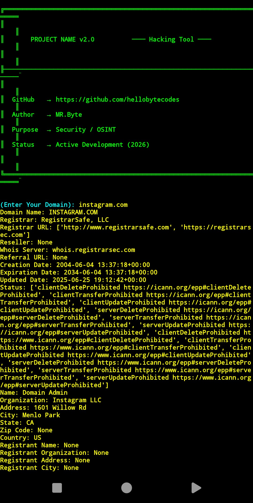

# Screen Shot


# Description
This tool is made for legal and OSINT purposes and you can use this tool to get various information from a site Note: Use legally

# install Termux / Kali-Linux
```bash
git clone https://github.com/hellobytecodes/WhoInfo
```
```bash
cd WhoInfo
```
```bash
pip install -r requirements.txt
```
```bash
python whoInfo.py
```
# last word
I have almost nothing to say, I just hope you use it well. God bless. 👋♥️
